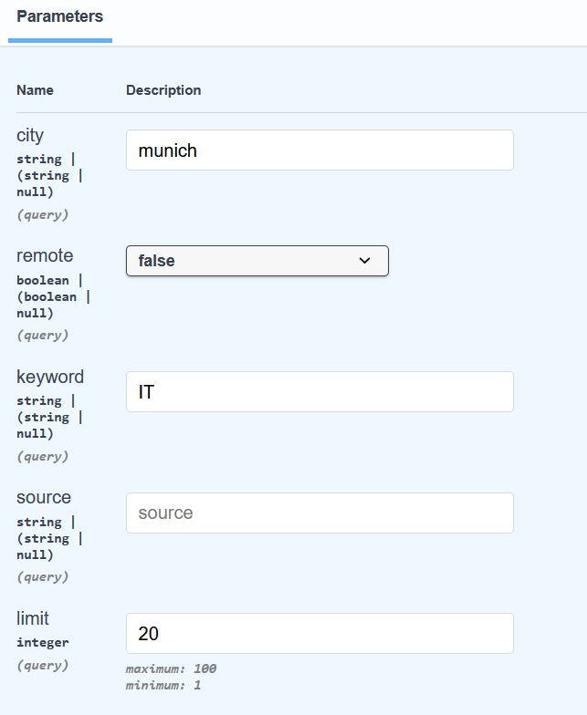
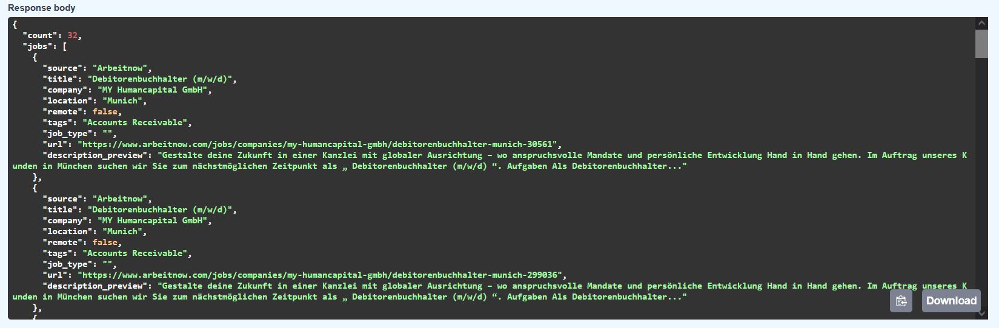
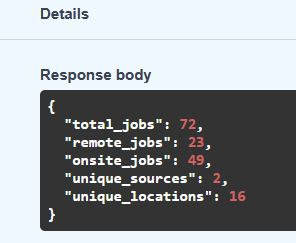

# FastAPI Job Data Backend

A **FastAPI backend service** that serves job and internship data through a REST API, with filtering and basic analytics.

The CSV data used in this project comes from the pipeline that I also created: https://github.com/breixoperezalvarez/germany-job-search-pipeline

---

## Features

 Filter jobs by:
  - city
  - remote / onsite
  - keyword (title/company)
  - source
  - limit

---

## Tech Stack

- Python
- FastAPI
- pandas
- Uvicorn

---

## How to Run

### 1. Clone the repository

git clone https://github.com/breixoperezalvarez/fastapi-backend-jobdata-service.git
cd fastapi-backend-jobdata-service

### 2. Create virtual environment
python -m venv .venv
source .venv/Scripts/activate   # Windows (Git Bash)

### 3. Install dependencies
pip install -r requirements.txt

### 4. Run the API
python -m uvicorn app.main:app

### 5. Open in browser
http://127.0.0.1:8000/docs

---

## API Endpoints

## /jobs
Get filtered job listings by choosing the parameters you want:

  

Response:
  

  

  
## /stats
Get general dataset statistics:
  

  

